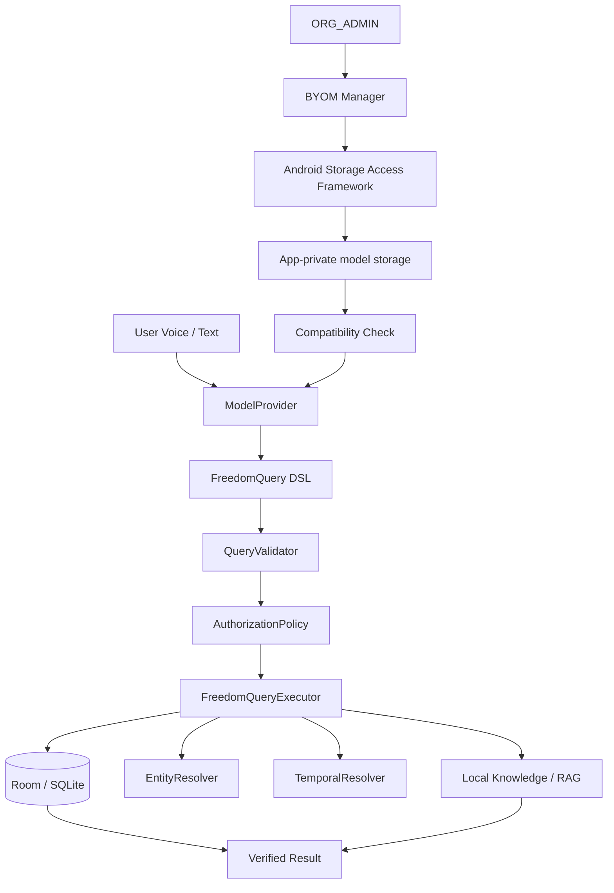
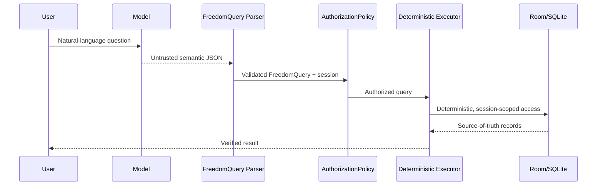

# FREEDOM — Local-First AI Agent Framework for Resource-Constrained Android

> **Local by default. Cloud by exception. User decides.**

[](https://github.com/roshanzameerb07/FREEDOM-local-first-agent/actions/workflows/android-ci.yml)
[-green.svg)](https://developer.android.com)
[](#testing--quality-control)
[](#testing--quality-control)
[](#testing--quality-control)
[](https://ai.google.dev/edge/litert)
[](LICENSE)

---

## ASYNC'26 technical-review readiness

This README follows the repository structure requested in the **ASYNC'26 Technical Guidelines — Repository README Standards**:

| Guideline area | Repository evidence |
|---|---|
| Context & overview | Problem, target users, value proposition, feature summary |
| Architecture & system design | Architecture and end-to-end data-flow diagrams below |
| Installation & configuration | Exact Android/Gradle versions, prerequisites, build commands, model-asset setup |
| Developer experience | Usage snippets, tests, lint, CI workflow |
| Reliability, performance & security | Benchmark evidence, maturity status, limitations, troubleshooting, security reporting |
| Governance & license | CONTRIBUTING.md, SECURITY.md, LICENSE |
| Demo media | Final UI screenshots/video must be added to the marked media section before technical review |

> Source checklist: ASYNC'26 requires a standardized README covering overview, architecture, installation/configuration, testing, benchmarks/limitations/security, and licensing/governance. fileciteturn406file0L5-L7

---

## 1. Context & Overview

### Elevator pitch

**FREEDOM** is an Android local-first AI agent framework for field organizations that need conversational access to operational data without making a remote LLM the source of truth.

The AI model is treated as an **untrusted semantic parser**. It converts a natural-language request into a bounded **FreedomQuery** representation. Validation, authorization, calculations, database access, and business rules remain deterministic Kotlin code.

The first reference implementation is a dairy milk-collection workflow for resource-constrained Android devices.

### Problem

Field workers can work with intermittent connectivity, but conventional cloud-first assistants introduce two technical problems:

1. Operational data may have to leave the device before it can be queried.
2. A generative model can produce plausible but incorrect values if it is allowed to calculate business facts directly.

FREEDOM separates those responsibilities:

```
Natural language
      ↓
Local model / provider
      ↓
FreedomQuery (typed, bounded)
      ↓
Validation
      ↓
Authorization
      ↓
Deterministic Kotlin execution
      ↓
Room / SQLite
      ↓
Verified result
```

### Target users

- Rural field workers who need a simple operational UI.
- Cooperatives and field organizations that need local data ownership.
- Organization administrators who need role control and compatible local-model management.

### Current reference domain

**Milk collection** is the first concrete profile. The framework is intentionally structured so the local model can be replaced without rewriting the deterministic query and storage layers.

---

## 2. Core Features

### Implemented

- **Local model provider abstraction:** ModelProvider separates model inference from the application core.
- **Canonical FreedomQuery DSL:** model output is bounded to a typed semantic representation.
- **Deterministic execution:** FreedomQueryExecutor handles filtering, aggregation, temporal resolution, entity resolution, and data access.
- **Authorization boundary:** AuthorizationPolicy checks the authenticated SessionContext before protected operations execute.
- **Room/SQLite local source of truth:** the model does not directly read or write the database.
- **Entity and temporal resolution:** canonical farmer identity and date-period handling are performed in Kotlin.
- **Local knowledge retrieval:** the reference profile includes local document retrieval with grounded citations.
- **Organization and role layer:** FIELD_WORKER, MANAGER, and ORG_ADMIN roles are represented in framework code.
- **Bring Your Own Model (BYOM):** an ORG_ADMIN can import a compatible .litertlm model into app-private storage, run a real compatibility test, and activate it.
- **Model failure fallback:** imported-model failure can fall back to the built-in provider and then deterministic parsing paths.
- **Offline-capable reference workflow:** core query and local-data operations are designed to operate without a cloud inference dependency.

### Planned / future

- Persistent model-manifest storage across app restarts.
- Multiple simultaneously registered model profiles with named switching.
- Organization-provisioned models during onboarding.
- Cryptographic offline activation / licensing.
- Organization-controlled peer-to-peer depot synchronization.
- Additional domain profiles such as inventory and field-health workflows.
- Hardware-specific NPU/DSP delegate optimization.

---

## 3. Architecture & System Design

### System architecture



### Model-provider boundary

```kotlin
interface ModelProvider {
    val providerId: String
    val displayName: String
    val providerType: ModelProviderType
    fun isAvailable(): Boolean
    suspend fun generateText(prompt: String): String?
    fun getModelInfo(): ModelInfo
}
```

The current Android implementation includes:

- FREEDOM-provided Qwen3-1.7B INT4 through LiteRT-LM.
- Imported .litertlm providers through the BYOM layer.
- A deterministic fallback path when a neural provider is unavailable.

### Security boundary



**Important invariant:** the model cannot choose the authenticated organizationId, workerId, or role.

### Documentation links

- Framework context and design notes: [FREEDOM_CONTEXT.md](FREEDOM_CONTEXT.md)
- Framework architecture report: [training/reports/freedom_framework_architecture.md](training/reports/freedom_framework_architecture.md)
- BYOM architecture report: [training/reports/freedom_byo_model_architecture.md](training/reports/freedom_byo_model_architecture.md)
- Android demo/deployment report: [training/reports/android_demo_credentials_and_deployment.md](training/reports/android_demo_credentials_and_deployment.md)
- Training/evaluation guide: [training/README.md](training/README.md)

There is currently no external HTTP API or OpenAPI surface in this repository; the primary interface is the Android application and its local framework APIs.

---

## 4. End-to-End Execution Flow

Example query:

> **"How much milk did Ramesh give this week?"**

1. The field worker enters the question.
2. The active ModelProvider generates semantic JSON.
3. QwenQueryParser converts the response into a typed FreedomQuery.
4. QueryValidator checks structural and semantic constraints.
5. AuthorizationPolicy verifies the current session's permissions.
6. EntityResolver maps the requested farmer to a local identity.
7. TemporalResolver resolves THIS_WEEK into concrete time boundaries.
8. FreedomQueryExecutor reads the required records from Room/SQLite.
9. Kotlin performs the requested aggregation.
10. The verified result is returned to the UI.

### Example semantic output

```json
{
  "type": "QUERY",
  "target": "MILK_RECORDS",
  "entity": "Ramesh",
  "entityScope": "SPECIFIC",
  "time": {
    "type": "RELATIVE",
    "period": "THIS_WEEK"
  },
  "aggregations": [
    {
      "type": "SUM",
      "field": "QUANTITY"
    }
  ]
}
```

The JSON is **not** executed as SQL. It is validated and interpreted by Kotlin.

---

## 5. Installation & Configuration

### Prerequisites

| Component | Required version / value |
|---|---|
| Operating system | Windows, macOS, or Linux suitable for Android Studio/Gradle |
| Java | JDK 17 |
| Gradle | 9.1.0 via repository wrapper |
| Android Gradle Plugin | 9.0.1 |
| Kotlin | 2.3.20 |
| Compile SDK | 36 |
| Target SDK | 36 |
| Minimum SDK | 26 (Android 8.0) |
| Android device | Android 8.0+; a device with sufficient RAM for the selected local model is recommended |

The project uses the checked-in Gradle wrapper, so a system Gradle installation is not required.

### Clone

```bash
git clone https://github.com/roshanzameerb07/FREEDOM-local-first-agent.git
cd FREEDOM-local-first-agent
git checkout framework/organization-model-layer
```

### Linux / macOS

```bash
./gradlew testDebugUnitTest
./gradlew lintDebug
./gradlew assembleDebug
```

### Windows

```bat
gradlew.bat testDebugUnitTest
gradlew.bat lintDebug
gradlew.bat assembleDebug
```

APK output:

```text
app/build/outputs/apk/debug/app-debug.apk
```

### Model artifact setup

Large .litertlm binaries are deliberately excluded from Git.

For the built-in Qwen3 provider, the expected bundled asset filename is:

```text
app/src/main/assets/qwen3-1.7b-int4.litertlm
```

When the asset is absent, the application can still build and the framework can rely on its deterministic/fallback paths or an imported BYOM model.

**Do not commit .litertlm model binaries.** The repository .gitignore excludes them.

### Environment variables matrix

This Android application currently requires **no mandatory .env file and no runtime environment variables**.

| Key | Type | Default | Required | Purpose |
|---|---|---|---|---|
| None | — | — | No | App configuration is currently compiled/configured through Android/Kotlin project files |

---

## 6. Developer Experience & Usage

### Demo login

The current code contains a dedicated hackathon demo account:

```text
Organization ID: FREEDOM-DEMO-001
Worker ID:       DEMO-FIELD-01
Password:        FreedomDemo@2026
```

A legacy demo account is also retained in code:

```text
Organization ID: ORG001
Worker ID:       WORKER001
Password:        1234
```

These credentials are for local demonstration/testing only.

### Example user queries

```text
How much milk did Ramesh give this week?
How much milk was collected today?
Did Ramesh get paid?
Who are the farmers with pending payment?
Show the top farmers by weekly milk quantity.
```

### BYOM usage

ORG_ADMIN flow:

```text
Admin
  → Local Models
  → Import Local Model
  → select a .litertlm file
  → model copied into FREEDOM private storage
  → SHA-256 calculated locally
  → Check Compatibility
  → Activate
```

Compatibility is tested using real LiteRT-LM inference and the current FreedomQuery validation pipeline. A legacy/invalid format cannot be activated.

---

## 7. Testing & Quality Control

### Primary QA commands

```bash
./gradlew testDebugUnitTest
./gradlew lintDebug
./gradlew connectedDebugAndroidTest
```

On Windows, use gradlew.bat instead of ./gradlew.

### Test coverage areas

The repository contains tests for:

- organization/profile initialization
- user roles and permissions
- authorization allow/deny cases
- model provider registration and switching
- session isolation
- FreedomQuery parsing and validation
- deterministic aggregations and filters
- entity resolution and ambiguity handling
- temporal resolution
- payment-state logic
- local RAG retrieval
- number-fidelity reconciliation
- BYOM import, compatibility, activation, and removal behavior

### CI

The repository now includes:

```text
.github/workflows/android-ci.yml
```

The CI workflow runs unit tests, Android Lint, and a debug APK build on pushes and pull requests.

### Coverage status

A dedicated JaCoCo coverage pipeline is **not yet configured**. The README badge intentionally reports this state instead of presenting an unverified percentage.

---

## 8. Reliability, Performance & Security

### Benchmarks / evidence currently in the repository

| Area | Evidence |
|---|---|
| Dataset size | 9,000 stored examples across pilot/train/validation/test/hard-test |
| Dataset split | 500 / 5,950 / 850 / 850 / 850 |
| Entity leakage | Pairwise intersections reported as 0 across train/validation/test/hard-test |
| Token-load audit | Reported maximum total token count: 268; 100% under 512 tokens |
| Local GPU audit | RTX 3050 A Laptop GPU, 4,094 MiB dedicated VRAM |
| App runtime latency | No authoritative end-to-end Android latency benchmark is currently committed |
| Maturity | **Alpha / hackathon prototype — not production-ready** |

The training reports are preserved under [training/reports/](training/reports/). The repository explicitly avoids fabricated model-benchmark results when an evaluation environment is unavailable.

### Security model

- Model output is treated as untrusted input.
- The model does not directly generate raw SQL.
- organizationId and user identity come from the authenticated session.
- Authorization is enforced in Kotlin, not by model instructions.
- Imported model SHA-256 is calculated over the actual local file bytes.
- Imported model files are stored under app-private storage.
- Removing a model does not delete Room operational data.
- The app's core local inference/data path does not require a cloud LLM endpoint.

### Security reporting

See [SECURITY.md](SECURITY.md). Do not disclose exploitable security issues in a public issue.

---

## 9. Troubleshooting & Known Limitations

| Issue | Cause | Action |
|---|---|---|
| Gradle cannot start | Wrong Java version | Install/use JDK 17 and verify java -version |
| Build succeeds but no neural inference is available | Qwen .litertlm asset is not present | Supply the expected asset locally or import a compatible BYOM model |
| Model initialization is slow | Large on-device model and native runtime initialization | Allow first-launch initialization to complete; deterministic paths remain available |
| Imported model cannot be activated | Output does not satisfy the current FreedomQuery contract | Run compatibility check again with a valid .litertlm model |
| Imported model disappears after process/app restart | Model manifest persistence is currently in-memory | Re-import the model; persistent manifest storage is planned |
| Only one active provider is available at a time | Registry is intentionally single-active | Deactivate/replace the current provider before switching |
| APK becomes very large when model is bundled | The local model and native runtime are packaged with the app | Keep model binaries out of Git; use a local build artifact or a future delivery mechanism |

### Current implementation limitations

1. **Single active organization profile per runtime session:** multiple organization profiles can exist in the framework, but the current application operates on one active profile at a time.
2. **Bounded Room schema:** fully arbitrary runtime SQL/table creation is intentionally not supported.
3. **Model-manifest persistence:** imported-model registrations are currently in-memory and are not yet durable across app restarts.
4. **Single active model provider:** the registry activates one provider at a time.
5. **Runtime benchmark gap:** no committed end-to-end latency/throughput benchmark for Android inference is currently available.
6. **Production security hardening:** the project is an Alpha/hackathon prototype and should not be treated as a production deployment without additional credential, storage, update, and activation hardening.

---

## 10. Demo Screenshots & Media

The ASYNC'26 guideline asks for high-resolution screenshots, GIFs, or a demo-video link showing the working UI. fileciteturn406file0L13-L14

### Final media to add before technical review

- docs/media/home.png — worker home screen
- docs/media/collect-milk.png — milk-record entry
- docs/media/ask-freedom.png — natural-language query result
- docs/media/local-models.png — ORG_ADMIN BYOM screen
- docs/media/architecture.png — architecture overview
- docs/media/demo-video.md — final 3-minute demo-video link

**These must be captured from the actual working Android build.** No placeholder image is presented as a real product screenshot.

---

## 11. Governance, License & Contribution

### License

This repository is licensed under the **Apache License 2.0**. See [LICENSE](LICENSE).

### Contribution

See [CONTRIBUTING.md](CONTRIBUTING.md) for:

- branch and pull-request expectations
- Kotlin/Android code-style expectations
- deterministic framework invariants
- testing requirements

### Architecture rules contributors must preserve

```
Model output = untrusted
        ↓
FreedomQuery
        ↓
Validation
        ↓
Authorization
        ↓
Deterministic execution
        ↓
Room / SQLite
```

Do not bypass this boundary by:

- adding raw model-generated SQL execution
- allowing the model to choose identity/permissions
- storing operational truth inside model prompts or model state
- replacing deterministic business calculations with free-form generation

---

## 12. Repository Structure

```text
FREEDOM-local-first-agent/
├── app/
│   └── src/
│       ├── main/
│       │   ├── java/com/example/freedom/
│       │   └── assets/
│       └── test/
├── training/
│   ├── dataset/
│   ├── evaluation/
│   ├── generators/
│   ├── leakage/
│   ├── reports/
│   ├── schema/
│   ├── validators/
│   ├── configs/
│   └── train_sft.py
├── .github/workflows/android-ci.yml
├── FREEDOM_CONTEXT.md
├── CONTRIBUTING.md
├── SECURITY.md
├── LICENSE
├── README.md
└── gradle/
```

---

## 13. Current Reference Implementation

The first domain profile is **milk collection**. It demonstrates:

- farmer and milk-record entities
- quantity, FAT, SNF, and payment information
- local records and summaries
- role-aware access
- conversational local queries
- deterministic calculations
- local knowledge retrieval
- BYOM-compatible model replacement

The framework is designed so that the **domain profile can evolve independently of the local model runtime boundary**.

---

## 14. Repository Status

**Current branch:** framework/organization-model-layer

**Current focus:** ASYNC'26 technical-review preparation, Android product demo, local-first framework documentation, and reproducible CI.

**Maturity:** Alpha / hackathon prototype.

**Model binaries:** intentionally excluded from Git.

**External cloud inference:** not required for the core local query path.

---

## 15. Acknowledged evidence and technical honesty

The repository contains detailed audit reports for dataset generation, leakage checks, GPU constraints, framework architecture, BYOM behavior, and Android deployment. Where a metric has not been measured in the current repository, this README explicitly marks it as unavailable rather than substituting an estimate.

